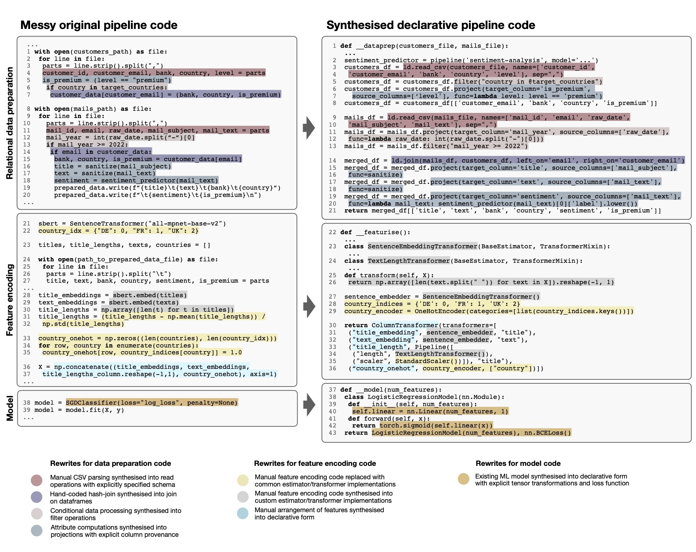

# Overview

This repository contains the supplementary material for our submission _"Towards Regaining Control over
Messy Machine Learning Pipelines"_. Our prototype runs [declaratively specified ML pipelines](lester/classification.py) via a [dataframe API](lester/__init__.py) with basic relational operations and provenance tracking for rows and columns, estimator/transformers with [matrix column provenance](lester/feature_provenance.py) and models specified in PyTorch.

## LLM-assisted rewrites of messy pipeline code

At the core of our proposal is the idea to [rewrite messy code](lester/rewrite/__init__.py) for [various pipeline stages](lester/benchmark/__init__.py) based on LLMs with [custom designed prompts](lester/rewrite/prompts.py). We provide example rewrites for [nine different rewriting tasks](lester/benchmark) with their corresponding [synthesised pipeline code](synthesised_code.py).

We provide further details on [preliminary experiments](synthesised.md) in an extra page.

## Provenance-based unlearning for all pipeline artifacts

Our prototype materialises the produced [pipeline artifacts](lester/unlearning/artifacts.py) and subsequently allows us to conduct provenance-based unlearning on these artifacts with low latency. We implement the unlearning of [feature values](lester/unlearning/feature_deletion.py) and [instances](lester/unlearning/instance_deletion.py) from all pipeline artifacts. The deletion for the relational training data and the encoded features is based on provenance and uses dataframe and numpy operations. The unlearning from the trained model is conducted via a recently proposed [first-order update](https://www.ndss-symposium.org/wp-content/uploads/2023/02/ndss2023_s87_paper.pdf).

## Running example

We provide a working implementation of the [messy example pipeline](messy_original_pipeline.py) from the running example in the submission. This pipeline is rewritten with the help of OpenAI's [gpt-4o](https://openai.com/index/hello-gpt-4o/) model as follows:

 1. The [messy data preparation code](lester/benchmark/creditcard_dataprep.py) is [synthesised to dataframe operations](synthesised_code.py#L2) with provenance tracking via the [generate_dataprep_code](lester/rewrite/__init__.py#L17) function.
 1. The  [messy featurisation code](lester/benchmark/creditcard_featurisation.py) is [synthesised to estimator/transformer oeprations](synthesised_code.py#L117) via the [generate_featurisation_code](lester/rewrite/__init__.py#L40) function.
 1. The [custom logistic regression model](lester/benchmark/sklearnlogreg_model.py) is [synthesised to tensor operations in PyTorch](synthesised_code.py#L117) via the [generate_model_code](lester/rewrite/__init__.py#L54) function.

## Experiments

We provide the code for the [evaluation of the synthesis](experiment__rewrite.py) for the nine example tasks, and for measuring the runtime of [retraining from scratch](experiment__retraining_time.py) versus the runtime for [targeted unlearning](experiment__unlearning.py). Note that the pipeline must be [executed first](run_rewritten_pipeline.py) for the latter experimented, and a [large input file](data/synthetic_mails_100000.csv.zip) must be unpacked first.
  
