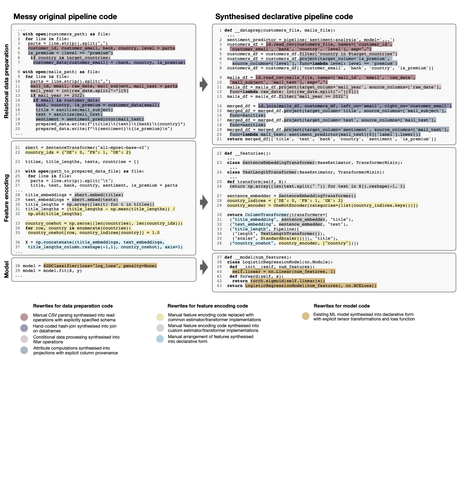

## Overview

This repository contains the supplementary material for our submission "Towards Regaining Control over
Messy Machine Learning Pipelines".

 * [run declaratively specified ML pipelines](lester/classification.py)
 * [Dataframe API](lester/__init__.py) with basic relational operations and provenance tracking for rows and columns
 * [matrix column provenance](lester/feature_provenance.py) for Estimator/Transformers used to encode features

### LLM-assisted rewrites of messy pipeline code

 * [custom designed prompts](lester/rewrite/prompts.py) to [rewrite code](lester/rewrite/__init__.py) for [various pipeline stages](lester/benchmark/__init__.py)
 * [nine different rewriting tasks](lester/benchmark) and the corresponding [synthesise pipeline code](synthesised_code.py)

### Provenance-based unlearning for all pipeline artifacts

 * materialisation of [pipeline artifacts](lester/unlearning/artifacts.py)
 * unlearning of [feature values](lester/unlearning/feature_deletion.py) and [instances](lester/unlearning/instance_deletion.py) based on provenance with dataframe and numpy operations, unlearning from model conducted via a recently proposed [first-order update](https://www.ndss-symposium.org/wp-content/uploads/2023/02/ndss2023_s87_paper.pdf)

## Running example

 * [Messy original pipeline](messy_original_pipeline.py) for our running example
 *  [Synthesised data preparation code](synthesised_code.py#L2) from [messy input code](lester/benchmark/creditcard_dataprep.py)  via the [generate_dataprep_code](lester/rewrite/__init__.py#L17)
 *  [Synthesised featurisation code](synthesised_code.py#L117) from [messy input code](lester/benchmark/creditcard_featurisation.py) via the [generate_featurisation_code](lester/rewrite/__init__.py#L40)
 *  [Synthesised learning code](synthesised_code.py#L117) from [messy input code](lester/benchmark/sklearnlogreg_model.py) via the  [generate_model_code](lester/rewrite/__init__.py#L54)

## Experiments

* [evaluation of the synthesised code](experiment__rewrite.py) for the nine example tasks
* [retraining from scratch](experiment__retraining_time.py) vs [targeted unlearning](experiment__unlearning.py). Pipeline must be [executed first](run_rewritten_pipeline.py) as preparation. +link to large file
  
